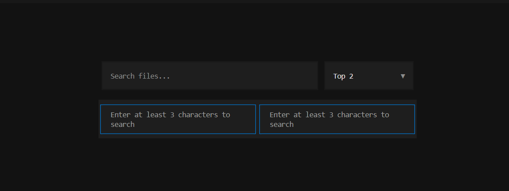

# ContextCore

> One MCP server for all your local files. Search everything, send only what matters to AI.

Stop pasting entire files into Claude. ContextCore indexes your notes, code, documents, images, audio, and video locally — then exposes a single MCP server that any AI tool can query. Instead of bloating your context window, Claude searches first and retrieves only the relevant chunks.

**57% fewer tokens. Same answers. No cloud.**

| Benchmark Setup | Baseline Context | ContextCore Context | Reduction |
|----------------|------------------|---------------------|-----------|
| SciFact (top-5 retrieved docs vs chunked context) | 1,723.5 tokens/query | 733.4 tokens/query | **57.45%** |

Works with: **Claude Desktop · Claude Code · Cursor · Cline · OpenCode · any MCP-compatible tool**

---

## Why ContextCore?

Most developers working across large codebases or document collections hit the same wall: pasting everything into context is expensive, slow, and hits limits. RAG pipelines require infrastructure. Other memory tools are cloud-only or single-format.

ContextCore is a local-first MCP server that does hybrid search (BM25 + embeddings) across every file type you care about — and registers itself with your AI tools automatically. One install. One server. All your data.

It is not Supermemory. It does not sync to a cloud. Your files stay on your machine. What it gives you is supercharged retrieval across every local file format, surfaced directly inside Claude and other tools via MCP.

This is the **one MCP to rule them all** design: instead of managing separate MCP servers for different file types, you have one local server with a consistent search API across text, code, images, audio, and video.

---

## How It Works

1. `contextcore init` — indexes your chosen folders (text, code, images, audio, video)
2. Registers as an MCP server with Claude Desktop, Claude Code, Cursor, or Cline
3. When you ask Claude about your files, ContextCore intercepts with a `search` tool call
4. Only the top matching chunks are injected into context — not the whole file

The hybrid search combines BM25 (keyword) and embeddings (semantic) so it handles both exact lookups ("find the function called parse_config") and fuzzy concept searches ("where did I write about the retry logic?").

---




## Install

Install from PyPI:

```powershell
python -m pip install contextcore==1.0.0
```

Optional source install (for contributors):

```powershell
git clone https://github.com/lucifer-ux/SearchEmbedSDK.git
cd SearchEmbedSDK
python -m pip install -e .
```

Then run the setup wizard:
```bash
contextcore init
```


Gif is sped up to skip the installation parts.

That's it. ContextCore indexes your files, registers with your AI tools, and runs in the background. No config files to edit.

## Prerequisites

- Python 3.10+
- Windows, macOS, or Linux
- Internet access for first-time model downloads
- Enough disk space for Python packages and model files

Optional but important:
- `ffmpeg` for video indexing
- Claude Desktop or another MCP-capable tool if you want interactive AI integration

## What ContextCore Does

ContextCore gives you:
- a CLI command: `contextcore`
- a local backend server, normally on `http://127.0.0.1:8000`
- an MCP server script for Claude and similar tools
- local indexing for:
  - text and documents
  - images
  - audio transcripts
  - video embeddings and video context
  - codebase context (structure, symbols, dependencies, file-level detail)

## Codebase Context for Claude/OpenCode

ContextCore can expose your codebase context directly to MCP tools (for example, Claude Desktop and OpenCode) so the model can reason over your project without you pasting the entire directory into chat.

Use the code modality during setup (`contextcore init`) and ContextCore will provide indexed codebase context through MCP tools such as:
- `get_codebase_context`
- `get_codebase_index`
- `get_module_detail`
- `get_file_content`

## Recommended Setup

For real usage, the most reliable setup is:
- keep one dedicated Python virtual environment
- use that same Python environment for:
  - `contextcore init`
  - `contextcore serve`
  - `mcp_server.py` in your Claude config

Do not test the backend in one venv and point Claude at a different venv. That is one of the most common causes of "it works in the terminal but not in Claude".

## Verify Install

Run:

```powershell
contextcore --help
```

If that fails, the package is not installed in the Python environment your shell is using.

## BEIR Benchmark (SciFact)

You can benchmark the current text retrieval stack on a BEIR dataset (starting with SciFact) without touching your existing index data.

Install optional benchmark dependency:

```powershell
python -m pip install beir
```

Run benchmark:

```powershell
contextcore benchmark --dataset scifact --top-k 10
```

Optional fast iteration with fewer queries:

```powershell
contextcore benchmark --dataset scifact --top-k 10 --max-queries 50
```

Optional JSON output:

```powershell
contextcore benchmark --dataset scifact --output-json .\benchmarks\scifact_run.json
```

Token reduction benchmark (tiktoken):

```powershell
python -m pip install tiktoken
contextcore benchmark --dataset scifact --top-k 10 --measure-tokens --context-top-k 5
```

Compare retrieval systems (ContextCore vs BM25) and export publish-ready tables:

```powershell
contextcore benchmark --dataset scifact --top-k 10 --measure-tokens --context-top-k 5 --systems contextcore_hybrid,bm25_only,trigram_only --report-csv .\benchmarks\scifact_compare.csv --report-md .\benchmarks\scifact_compare.md --output-json .\benchmarks\scifact_compare.json
```

## Daily Commands

### Show status

```powershell
contextcore status
```

This shows:
- whether the backend server is running
- whether the MCP server script is present
- counts for text, images, audio, and video
- whether video runtime dependencies are available

### Run indexing again

```powershell
contextcore index
```

Or for a specific folder:

```powershell
contextcore index "C:\Users\USER\Documents\test"
```

### Start backend manually

```powershell
contextcore serve
```

By default, ContextCore uses port `8000`.

Background server shortcuts:

```powershell
contextcore start
contextcore stop
contextcore restart
contextcore server status
```

### Remove ContextCore from this machine

```powershell
contextcore uninstall
```

Preview without deleting anything:

```powershell
contextcore uninstall --dry-run
```

Fully remove local data and also uninstall the pip package:

```powershell
contextcore uninstall --yes --remove-package
```

### Diagnose setup problems

```powershell
contextcore doctor
```

### Report an issue to GitHub

```powershell
contextcore report image search returned empty even though file exists
```

If you run `contextcore report` without text, it will prompt for a description.

For automatic issue creation, authenticate with either:

```powershell
gh auth login
```

or set a token:

```powershell
$env:CONTEXTCORE_GITHUB_TOKEN = "ghp_xxx"
```

### Pull latest fixes

```powershell
contextcore update
```

This command always targets the `sdk_root` saved during `contextcore init`,
so it works even if you run it from another folder.

If you do not want an automatic background-server restart after update:

```powershell
contextcore update --no-restart
```

### Register with a tool later

```powershell
contextcore register claude-desktop
contextcore register claude-code
contextcore register cursor
contextcore register cline
```

Or use the standalone registrar script:

```bash
python register_mcp.py --list
python register_mcp.py --tool claude-code
python register_mcp.py --dry-run
python register_mcp.py --all
```

### Install optional model stacks manually

```powershell
contextcore install clip
contextcore install audio
contextcore install all
```

## Expected Status Output

A healthy setup usually looks like:

```text
Server
------------------------------------------------------------------------------
  [OK] Running on port 8000
  [OK] MCP server script found

Index Progress
------------------------------------------------------------------------------
  Text     > 0   ready
  Images   > 0   ready
  Audio    > 0   ready
  Video    > 0   ready
```

If `Video` shows `missing ffmpeg`, video indexing is not ready.

If `Video` shows `model unavailable`, the CLIP model is not ready in the active environment.

## Claude Desktop Setup

Use the same Python executable that you used for the CLI and backend.

Example Claude MCP config:

```json
{
  "mcpServers": {
    "contextcore": {
      "command": "C:\\Users\\USER\\Documents\\SDKSearchImplementation\\SearchEmbedSDK\\.venv\\Scripts\\python.exe",
      "args": [
        "C:\\Users\\USER\\Documents\\SDKSearchImplementation\\SearchEmbedSDK\\mcp_server.py"
      ],
      "cwd": "C:\\Users\\USER\\Documents\\SDKSearchImplementation\\SearchEmbedSDK",
      "env": {
        "CONTEXTCORE_API_BASE_URL": "http://127.0.0.1:8000",
        "CONTEXTCORE_MCP_TIMEOUT_SECONDS": "120"
      }
    }
  }
}
```

Important:
- `command` should point to the Python inside the venv you are actively using
- `args` should point to this repo's `mcp_server.py`
- `cwd` should be the repo root
- `CONTEXTCORE_API_BASE_URL` should match the backend server port

After changing Claude config:
- fully quit Claude Desktop
- start the backend if it is not already running
- reopen Claude Desktop

## MCP Tool Usage Guide (for any LLM client)

Use this call order in Claude/Cursor/OpenCode/Cline:

1. `search` first for any user question about local files/content.
2. `fetch_content` after `search` when deeper file detail is required.
3. `get_neighbors` for adjacent text/audio chunk context.
4. `list_sources` for index/source diagnostics.
5. `index_content` only when user asks to reindex or results are stale/missing.
6. `prepare_file_for_tool` / `reveal_file` when user wants to open/attach local files.

Guidelines:
- Default to `modality=all` unless user explicitly asks for image/video/audio/text only.
- If search is empty or low confidence, run `index_content`, then retry `search`.
- Do not hallucinate answers when retrieval is empty.

## Claude Code Setup

Claude Code user config path:

```text
~/.claude.json
```

If you do not see ContextCore under `/mcp`, add this manually:

```json
{
  "mcpServers": {
    "contextcore": {
      "type": "stdio",
      "command": "/Users/<you>/.contextcore/.venv/bin/python",
      "args": [
        "/Users/<you>/.contextcore/mcp_server.py"
      ]
    }
  }
}
```

Typical values by OS:
- macOS/Linux `command`: `/Users/<you>/.contextcore/.venv/bin/python`
- macOS/Linux `args[0]`: `/Users/<you>/.contextcore/mcp_server.py`
- Windows `command`: `C:\\Users\\<you>\\.contextcore\\.venv\\Scripts\\python.exe`
- Windows `args[0]`: `C:\\Users\\<you>\\.contextcore\\mcp_server.py`

To get exact values from your machine:

```bash
cd ~/.contextcore
echo "python: $(pwd)/.venv/bin/python"
echo "mcp_server: $(pwd)/mcp_server.py"
```

Windows PowerShell:

```powershell
Set-Location $env:USERPROFILE\.contextcore
Write-Host "python: $((Get-Location).Path)\.venv\Scripts\python.exe"
Write-Host "mcp_server: $((Get-Location).Path)\mcp_server.py"
```

Then:
- ensure backend is running (`contextcore status` should show port 8000)
- restart Claude Code completely
- run `/mcp` again inside Claude Code

Deterministic path detection (recommended):

```bash
python detect_paths.py
python detect_paths.py --json
python detect_paths.py --mcp-config
python detect_paths.py --claude-json
python detect_paths.py --shell
python detect_paths.py --validate
```

This script resolves Python and `mcp_server.py` deterministically and validates
that your environment is usable before you paste config values.

## Backend Health Check

You can verify the backend directly:

```powershell
Invoke-WebRequest http://127.0.0.1:8000/health
```

If the backend is healthy, you should get a successful response.

## Troubleshooting

### 1. `contextcore` command not found

Cause:
- venv not activated
- package not installed in the active Python environment

Fix:

```powershell
python -m pip install contextcore==1.0.0
```

### 2. `contextcore init` fails on import errors

Cause:
- dependencies were not installed into the active venv
- wrong Python interpreter is being used

Fix:

```powershell
python -m pip install --upgrade pip
python -m pip install --force-reinstall contextcore==1.0.0
```

If you are developing from source instead of PyPI:

```powershell
pip install -r requirements.txt
pip install -e .
```

Then verify:

```powershell
python -c "import questionary, typer, fastapi; print('ok')"
```

### 3. Server is healthy, but Claude says ContextCore is unavailable

Cause:
- Claude is using a different Python environment than the backend
- Claude config points at the wrong `python.exe`
- `cwd` is missing or wrong
- for Claude Code, MCP entry is missing from `~/.claude.json`

Fix:
- use the same venv in both places
- update Claude config `command`
- add `cwd`
- restart Claude Desktop fully
- in Claude Code, run `/mcp` and confirm `contextcore` is listed
- if `/mcp` is empty, add the `mcpServers.contextcore` entry shown in **Claude Code Setup**

### 4. Video says `missing ffmpeg`

Cause:
- `ffmpeg` is not installed
- `ffmpeg` exists but is not resolvable in the active runtime

Check:

```powershell
where.exe ffmpeg
ffmpeg -version
```

If not found:
- Windows: install via `winget`
- macOS: install via `brew`
- Linux: install via package manager

Examples:

```powershell
winget install Gyan.FFmpeg
```

```bash
brew install ffmpeg
sudo apt install ffmpeg
```

Then rerun:

```powershell
contextcore init
```

or:

```powershell
contextcore install all
```

### 5. Video says `model unavailable`

Cause:
- CLIP dependencies are installed but model files are not ready
- the wrong venv is being used

Fix:

```powershell
contextcore install clip
```

Then recheck:

```powershell
contextcore status
```

### 6. Audio is not indexing

Cause:
- Whisper is missing
- wrong venv
- unsupported or unreadable audio file

Fix:

```powershell
contextcore install audio
contextcore index
```

### 7. Backend starts, but indexing results stay at zero

Check:
- does the watched folder actually contain supported files?
- does `contextcore.yaml` point to the folder you think it does?

Your config usually lives at:

```text
C:\Users\USER\.contextcore\contextcore.yaml
```

Verify:
- `organized_root`
- `audio_directories`
- `video_directories`

Then run:

```powershell
contextcore index
contextcore status
```

### 8. Port mismatch between backend and Claude

ContextCore should use port `8000` unless you override it.

Check backend:

```powershell
contextcore status
```

Check Claude config:

```json
"CONTEXTCORE_API_BASE_URL": "http://127.0.0.1:8000"
```

These must match.

### 9. Old background servers are still running

Find them:

```powershell
Get-CimInstance Win32_Process | Where-Object {
  $_.CommandLine -match 'uvicorn unimain:app|mcp_server.py'
} | Select-Object ProcessId, ExecutablePath, CommandLine
```

Stop them:

```powershell
Stop-Process -Id <PID> -Force
```

Then start cleanly:

```powershell
contextcore serve
```

### 10. Git or IDE shows huge numbers of changes

Cause:
- virtual environments inside the workspace
- caches
- logs
- local config files

Do not create test venvs inside broad workspace roots unless they are ignored.

The repo already ignores common noise such as:
- `.venv/`
- `.venv-test/`
- storage DBs
- `__pycache__`
- logs

If your IDE still shows thousands of changes:
- refresh Source Control
- reload the IDE window
- verify your IDE workspace is rooted at the repo you actually want

## If You Need Help

When diagnosing problems, the highest-signal commands are:

```powershell
contextcore status
contextcore doctor
where.exe ffmpeg
Invoke-WebRequest http://127.0.0.1:8000/health
```

If something still fails, capture:
- the exact command you ran
- the full traceback or terminal output
- your `contextcore status` output
- the Python path used by Claude in your MCP config

That is usually enough to isolate the issue quickly.

## Publish to PyPI

ContextCore is now configured for packaging with `pyproject.toml` + `twine`.

### One-time setup

```powershell
python -m pip install --upgrade pip build twine wheel
```

Create your local PyPI credentials file:

1. Copy [`./.pypirc.example`](./.pypirc.example) to `%USERPROFILE%\.pypirc`
2. Replace token placeholders with real tokens
3. Keep `%USERPROFILE%\.pypirc` private (never commit)

### Build and publish

```powershell
# Build artifacts into ./dist
python -m build --no-isolation

# Validate metadata and long description
python -m twine check dist/*

# Upload to PyPI
python -m twine upload dist/*
```

Or use the helper script:

```powershell
# Upload to real PyPI
.\scripts\publish_pypi.ps1

# Upload to TestPyPI
.\scripts\publish_pypi.ps1 -Repository testpypi
```

### Token setup (recommended)

In `%USERPROFILE%\.pypirc` use:

```ini
[pypi]
username = __token__
password = pypi-<your-real-token>
```

Alternative (without `.pypirc`):

```powershell
$env:TWINE_USERNAME = "__token__"
$env:TWINE_PASSWORD = "pypi-<your-real-token>"
python -m twine upload dist/*
```