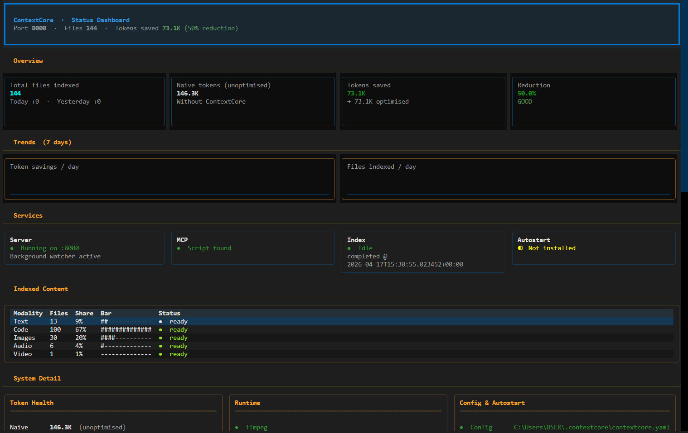

# ContextCore

Search all your local data — notes, code, recordings, images — 
and send only what matters to AI.

> Cut Claude API costs by 50–99% without losing context quality.

| Source       | Without ContextCore | With ContextCore | Reduction |
|-------------|-------------------|-----------------|-----------|
| Text notes  | 889,710 tokens    | 444,855 tokens  | 50%       |
| Codebase    | 97,868 tokens     | 1,085 tokens    | **98.9%** |



## Install

**macOS / Linux**
```bash
curl -sL https://raw.githubusercontent.com/lucifer-ux/SearchEmbedSDK/main/install.sh | bash
```

**Windows**
```powershell
irm https://raw.githubusercontent.com/lucifer-ux/SearchEmbedSDK/main/install.ps1 | iex
```

Then run the setup wizard:
```bash
contextcore init
```


Gif is sped up to skip the installation parts.
This is not supermemory, but supercharged memory for all file formats shared all across.

That's it. ContextCore indexes your files, registers with your AI tools, 
and runs in the background. No config files to edit.

## Prerequisites

- Python 3.10+
- Windows, macOS, or Linux
- Internet access for first-time model downloads
- Enough disk space for Python packages and model files

Optional but important:
- `ffmpeg` for video indexing
- Claude Desktop or another MCP-capable tool if you want interactive AI integration

## What ContextCore Does

ContextCore gives you:
- a CLI command: `contextcore`
- a local backend server, normally on `http://127.0.0.1:8000`
- an MCP server script for Claude and similar tools
- local indexing for:
  - text and documents
  - images
  - audio transcripts
  - video embeddings and video context
  - codebase context (structure, symbols, dependencies, file-level detail)

## Codebase Context for Claude/OpenCode

ContextCore can expose your codebase context directly to MCP tools (for example, Claude Desktop and OpenCode) so the model can reason over your project without you pasting the entire directory into chat.

Use the code modality during setup (`contextcore init`) and ContextCore will provide indexed codebase context through MCP tools such as:
- `get_codebase_context`
- `get_codebase_index`
- `get_module_detail`
- `get_file_content`

## Recommended Setup

For real usage, the most reliable setup is:
- keep one dedicated Python virtual environment
- use that same Python environment for:
  - `contextcore init`
  - `contextcore serve`
  - `mcp_server.py` in your Claude config

Do not test the backend in one venv and point Claude at a different venv. That is one of the most common causes of "it works in the terminal but not in Claude".

## Verify Install

Run:

```powershell
contextcore --help
```

If that fails, the venv is either not activated or the editable install did not complete.

## Daily Commands

### Show status

```powershell
contextcore status
```

This shows:
- whether the backend server is running
- whether the MCP server script is present
- counts for text, images, audio, and video
- whether video runtime dependencies are available

### Run indexing again

```powershell
contextcore index
```

Or for a specific folder:

```powershell
contextcore index "C:\Users\USER\Documents\test"
```

### Start backend manually

```powershell
contextcore serve
```

By default, ContextCore uses port `8000`.

Background server shortcuts:

```powershell
contextcore start
contextcore stop
contextcore restart
contextcore server status
```

### Diagnose setup problems

```powershell
contextcore doctor
```

### Register with a tool later

```powershell
contextcore register claude-desktop
contextcore register claude-code
contextcore register cursor
contextcore register cline
```

Or use the standalone registrar script:

```bash
python register_mcp.py --list
python register_mcp.py --tool claude-code
python register_mcp.py --dry-run
python register_mcp.py --all
```

### Install optional model stacks manually

```powershell
contextcore install clip
contextcore install audio
contextcore install all
```

## Expected Status Output

A healthy setup usually looks like:

```text
Server
------------------------------------------------------------------------------
  [OK] Running on port 8000
  [OK] MCP server script found

Index Progress
------------------------------------------------------------------------------
  Text     > 0   ready
  Images   > 0   ready
  Audio    > 0   ready
  Video    > 0   ready
```

If `Video` shows `missing ffmpeg`, video indexing is not ready.

If `Video` shows `model unavailable`, the CLIP model is not ready in the active environment.

## Claude Desktop Setup

Use the same Python executable that you used for the CLI and backend.

Example Claude MCP config:

```json
{
  "mcpServers": {
    "contextcore": {
      "command": "C:\\Users\\USER\\Documents\\SDKSearchImplementation\\SearchEmbedSDK\\.venv\\Scripts\\python.exe",
      "args": [
        "C:\\Users\\USER\\Documents\\SDKSearchImplementation\\SearchEmbedSDK\\mcp_server.py"
      ],
      "cwd": "C:\\Users\\USER\\Documents\\SDKSearchImplementation\\SearchEmbedSDK",
      "env": {
        "CONTEXTCORE_API_BASE_URL": "http://127.0.0.1:8000",
        "CONTEXTCORE_MCP_TIMEOUT_SECONDS": "120"
      }
    }
  }
}
```

Important:
- `command` should point to the Python inside the venv you are actively using
- `args` should point to this repo's `mcp_server.py`
- `cwd` should be the repo root
- `CONTEXTCORE_API_BASE_URL` should match the backend server port

After changing Claude config:
- fully quit Claude Desktop
- start the backend if it is not already running
- reopen Claude Desktop

## Claude Code Setup

Claude Code user config path:

```text
~/.claude.json
```

If you do not see ContextCore under `/mcp`, add this manually:

```json
{
  "mcpServers": {
    "contextcore": {
      "type": "stdio",
      "command": "/Users/<you>/.contextcore/.venv/bin/python",
      "args": [
        "/Users/<you>/.contextcore/mcp_server.py"
      ]
    }
  }
}
```

Typical values by OS:
- macOS/Linux `command`: `/Users/<you>/.contextcore/.venv/bin/python`
- macOS/Linux `args[0]`: `/Users/<you>/.contextcore/mcp_server.py`
- Windows `command`: `C:\\Users\\<you>\\.contextcore\\.venv\\Scripts\\python.exe`
- Windows `args[0]`: `C:\\Users\\<you>\\.contextcore\\mcp_server.py`

To get exact values from your machine:

```bash
cd ~/.contextcore
echo "python: $(pwd)/.venv/bin/python"
echo "mcp_server: $(pwd)/mcp_server.py"
```

Windows PowerShell:

```powershell
Set-Location $env:USERPROFILE\.contextcore
Write-Host "python: $((Get-Location).Path)\.venv\Scripts\python.exe"
Write-Host "mcp_server: $((Get-Location).Path)\mcp_server.py"
```

Then:
- ensure backend is running (`contextcore status` should show port 8000)
- restart Claude Code completely
- run `/mcp` again inside Claude Code

Deterministic path detection (recommended):

```bash
python detect_paths.py
python detect_paths.py --json
python detect_paths.py --mcp-config
python detect_paths.py --claude-json
python detect_paths.py --shell
python detect_paths.py --validate
```

This script resolves Python and `mcp_server.py` deterministically and validates
that your environment is usable before you paste config values.

## Backend Health Check

You can verify the backend directly:

```powershell
Invoke-WebRequest http://127.0.0.1:8000/health
```

If the backend is healthy, you should get a successful response.

## Troubleshooting

### 1. `contextcore` command not found

Cause:
- venv not activated
- editable install not run

Fix:

```powershell
.\.venv\Scripts\Activate.ps1
pip install -e .
```

### 2. `contextcore init` fails on import errors

Cause:
- dependencies were not installed into the active venv
- wrong Python interpreter is being used

Fix:

```powershell
python -m pip install --upgrade pip
pip install -r requirements.txt
pip install -e .
```

Then verify:

```powershell
python -c "import questionary, typer, fastapi; print('ok')"
```

### 3. Server is healthy, but Claude says ContextCore is unavailable

Cause:
- Claude is using a different Python environment than the backend
- Claude config points at the wrong `python.exe`
- `cwd` is missing or wrong
- for Claude Code, MCP entry is missing from `~/.claude.json`

Fix:
- use the same venv in both places
- update Claude config `command`
- add `cwd`
- restart Claude Desktop fully
- in Claude Code, run `/mcp` and confirm `contextcore` is listed
- if `/mcp` is empty, add the `mcpServers.contextcore` entry shown in **Claude Code Setup**

### 4. Video says `missing ffmpeg`

Cause:
- `ffmpeg` is not installed
- `ffmpeg` exists but is not resolvable in the active runtime

Check:

```powershell
where.exe ffmpeg
ffmpeg -version
```

If not found:
- Windows: install via `winget`
- macOS: install via `brew`
- Linux: install via package manager

Examples:

```powershell
winget install Gyan.FFmpeg
```

```bash
brew install ffmpeg
sudo apt install ffmpeg
```

Then rerun:

```powershell
contextcore init
```

or:

```powershell
contextcore install all
```

### 5. Video says `model unavailable`

Cause:
- CLIP dependencies are installed but model files are not ready
- the wrong venv is being used

Fix:

```powershell
contextcore install clip
```

Then recheck:

```powershell
contextcore status
```

### 6. Audio is not indexing

Cause:
- Whisper is missing
- wrong venv
- unsupported or unreadable audio file

Fix:

```powershell
contextcore install audio
contextcore index
```

### 7. Backend starts, but indexing results stay at zero

Check:
- does the watched folder actually contain supported files?
- does `contextcore.yaml` point to the folder you think it does?

Your config usually lives at:

```text
C:\Users\USER\.contextcore\contextcore.yaml
```

Verify:
- `organized_root`
- `audio_directories`
- `video_directories`

Then run:

```powershell
contextcore index
contextcore status
```

### 8. Port mismatch between backend and Claude

ContextCore should use port `8000` unless you override it.

Check backend:

```powershell
contextcore status
```

Check Claude config:

```json
"CONTEXTCORE_API_BASE_URL": "http://127.0.0.1:8000"
```

These must match.

### 9. Old background servers are still running

Find them:

```powershell
Get-CimInstance Win32_Process | Where-Object {
  $_.CommandLine -match 'uvicorn unimain:app|mcp_server.py'
} | Select-Object ProcessId, ExecutablePath, CommandLine
```

Stop them:

```powershell
Stop-Process -Id <PID> -Force
```

Then start cleanly:

```powershell
contextcore serve
```

### 10. Git or IDE shows huge numbers of changes

Cause:
- virtual environments inside the workspace
- caches
- logs
- local config files

Do not create test venvs inside broad workspace roots unless they are ignored.

The repo already ignores common noise such as:
- `.venv/`
- `.venv-test/`
- storage DBs
- `__pycache__`
- logs

If your IDE still shows thousands of changes:
- refresh Source Control
- reload the IDE window
- verify your IDE workspace is rooted at the repo you actually want

## If You Need Help

When diagnosing problems, the highest-signal commands are:

```powershell
contextcore status
contextcore doctor
where.exe ffmpeg
Invoke-WebRequest http://127.0.0.1:8000/health
```

If something still fails, capture:
- the exact command you ran
- the full traceback or terminal output
- your `contextcore status` output
- the Python path used by Claude in your MCP config

That is usually enough to isolate the issue quickly.